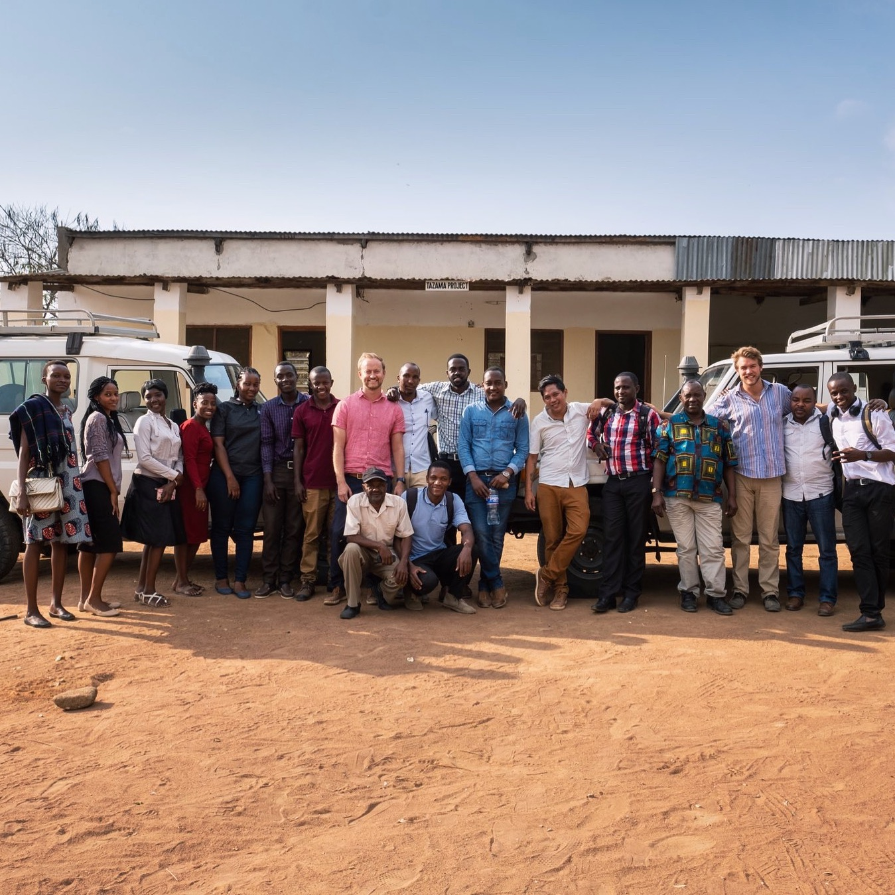

```{r setup, include=FALSE}
knitr::opts_chunk$set(echo = FALSE)

```


## Education

**University of California, Santa Barbara** | Santa Barbara, CA
*Ph.D. in Biological Anthropology* |  Ongoing

**University of California, Santa Barbara** | Santa Barbara, CA
*M.A. in Biological Anthropology* | August 2021

**University of Richmond** | Richmond, Virginia
*B.A. in Leadership Studies* | May 2017

## Research Experience

**Research Assistant to Dr. David Lawson, UCSB**
*Mwanza, Tanzania: Full time 40hr/week.*
(Jun 2019–Aug 2019)
Assisted in the training of the Tanzanian research team and led management of field data collection resulting in over 900 completed long form surveys for a study of men’s attitudes to women’s empowerment. 

**Primary Investigator, Project School House (PSH)**
*Rio Blanco, Nicaragua: Full time 40hr/week*
Jan 2019–April 2019	
Created original survey materials, trained local research assistant, and personally surveyed 8 rural Nicaraguan communities to evaluate the impact of PSH’s water and sanitation projects in treatment communities as well as collected baseline data to track the impact of interventions in prospective treatment communities.

**Research Assistant to Dr Christopher Von Rueden, University of Richmond.**
*Bolivia: Full and part time 10-40hr/week.*
(Jan 2017–July 2017)
Assisted in the preparation for and later implementation of field-based research of the Tsimane people in the Amazon rainforests of Bolivia. Including living with the Tsimane in the Tacuaral field-site, conducting month long survey research, and logging collected data for future analysis.


## Publications

**Kilgallen JA**, Schaffnit SB, Kumogola Y, Galura A, Urassa M. Lawson DW, (in press). *Positive correlation between women’s status and intimate partner violence suggests violence backlash in Mwanza, Tanzania. Journal of Interpersonal Violence.*
https://journals.sagepub.com/eprint/XIMAJIXGCYHCR7BIGDMT/full

Lawson DW, Schaffnit SB, **Kilgallen JA**, Kumogola Y, Galura A & Urassa M. (2021). *He for She? Variation and exaggeration in men’s support for women’s empowerment in northern Tanzania. Evolutionary Human Sciences. 3: E27.*
https://www.cambridge.org/core/journals/evolutionary-human-sciences/article/he-for-she-variation-and-exaggeration-in-mens-support-for-womens-empowerment-in-northern-tanzania/36A7D3C8FFBD3117316DA112C663CE35#ref38
