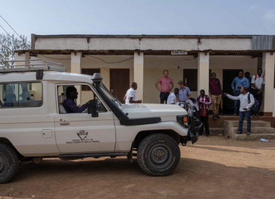
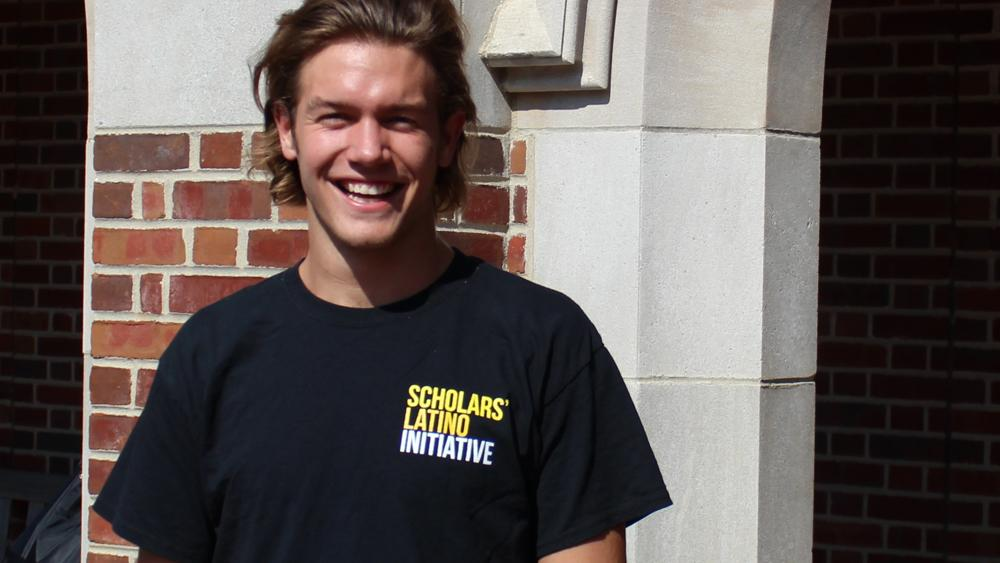

## Education

**University of California, Santa Barbara** | Santa Barbara, CA
*Ph.D. in Biological Anthropology* |  Ongoing

**University of California, Santa Barbara** | Santa Barbara, CA
*M.A. in Biological Anthropology* | August 2021

**University of Richmond** | Richmond, Virginia
*B.A. in Leadership Studies* | May 2017

## Conference Presentations

## Awards

## Additional Skills
- Advanced language ability in Kiswahili and Spanish

- Training in Qualitative field methodologies

- Training in Quantitative analysis in R 

## My Work in Press

https://www.news.ucsb.edu/2021/020475/cost-change

**The Cost of Change**

"Joseph Kilgallen, an anthropology graduate student and lead author of the study in the Journal of Interpersonal Violence, explained that violence backlash “refers to a particularly concerning pattern of behavior which we are observing across the globe in which men are responding to increases in women’s status/empowerment with violence as they attempt to maintain patriarchal control.”

https://news.richmond.edu/features/article/-/13829/joseph-kilgallen-17-jepson-senior-connects-with-students-during-internship-with-the-scholars-latino-initiative.html

**Jepson senior connects with students during internship with the Scholars Latino Initiative**

As an intern with the Richmond chapter of the Scholars Latino Initiative (SLI-VA), Joseph Kilgallen, ’17, spent his summer tutoring students and promoting awareness of the program in the community. Huddled around a table in a public library with a small group of immigrant high school students, Kilgallen led reading comprehension exercises and conversations on issues of global immigration and the rhetoric that surrounds them.

“The most rewarding aspect of working with SLI was forming the relationships with the students, sharing in their successes and learning from their experiences,” Kilgallen says. “We laughed and shared joy over successes and, at times, cried while discussing past hardships faced.”

